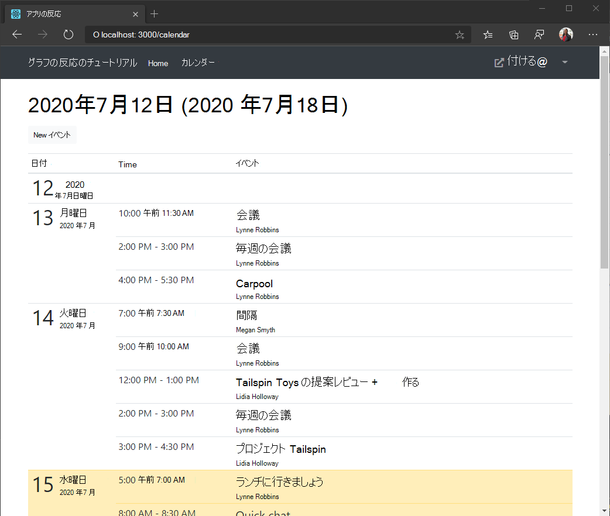

<!-- markdownlint-disable MD002 MD041 -->

<span data-ttu-id="1547e-101">この演習では、Microsoft Graph をアプリケーションに組み込む必要があります。</span><span class="sxs-lookup"><span data-stu-id="1547e-101">In this exercise you will incorporate the Microsoft Graph into the application.</span></span> <span data-ttu-id="1547e-102">このアプリケーションでは [、microsoft-graph-client ライブラリ](https://github.com/microsoftgraph/msgraph-sdk-javascript) を使用して Microsoft Graph を呼び出します。</span><span class="sxs-lookup"><span data-stu-id="1547e-102">For this application, you will use the [microsoft-graph-client](https://github.com/microsoftgraph/msgraph-sdk-javascript) library to make calls to Microsoft Graph.</span></span>

## <a name="get-calendar-events-from-outlook"></a><span data-ttu-id="1547e-103">Outlook からカレンダー イベントを取得する</span><span class="sxs-lookup"><span data-stu-id="1547e-103">Get calendar events from Outlook</span></span>

1. <span data-ttu-id="1547e-104">次 `./src/GraphService.ts` の関数を開いて追加します。</span><span class="sxs-lookup"><span data-stu-id="1547e-104">Open `./src/GraphService.ts` and add the following function.</span></span>

    :::code language="typescript" source="../demo/graph-tutorial/src/GraphService.ts" id="getUserWeekCalendarSnippet":::

    <span data-ttu-id="1547e-105">このコードの実行内容を考えましょう。</span><span class="sxs-lookup"><span data-stu-id="1547e-105">Consider what this code is doing.</span></span>

    - <span data-ttu-id="1547e-106">呼び出される URL は `/me/calendarview` です。</span><span class="sxs-lookup"><span data-stu-id="1547e-106">The URL that will be called is `/me/calendarview`.</span></span>
    - <span data-ttu-id="1547e-107">このメソッドは要求にヘッダーを追加し、応答の時間がユーザーの優先タイム ゾーン `header` `Prefer: outlook.timezone=""` に入っています。</span><span class="sxs-lookup"><span data-stu-id="1547e-107">The `header` method adds the `Prefer: outlook.timezone=""` header to the request, causing the times in the response to be in the user's preferred time zone.</span></span>
    - <span data-ttu-id="1547e-108">この `query` メソッドは、 `startDateTime` カレンダー ビュー `endDateTime` の時間のウィンドウを定義するパラメーターとパラメーターを追加します。</span><span class="sxs-lookup"><span data-stu-id="1547e-108">The `query` method adds the `startDateTime` and `endDateTime` parameters, defining the window of time for the calendar view.</span></span>
    - <span data-ttu-id="1547e-109">この `select` メソッドは、各イベントで返されるフィールドを、ビューが実際に使用するフィールドに制限します。</span><span class="sxs-lookup"><span data-stu-id="1547e-109">The `select` method limits the fields returned for each events to just those the view will actually use.</span></span>
    - <span data-ttu-id="1547e-110">このメソッドは、作成された日付と時刻で結果を並べ替え、最新のアイテム `orderby` が最初に表示されます。</span><span class="sxs-lookup"><span data-stu-id="1547e-110">The `orderby` method sorts the results by the date and time they were created, with the most recent item being first.</span></span>
    - <span data-ttu-id="1547e-111">この `top` メソッドは、1 ページの結果を 25 イベントに制限します。</span><span class="sxs-lookup"><span data-stu-id="1547e-111">The `top` method limits the results in a single page to 25 events.</span></span>
    - <span data-ttu-id="1547e-112">応答に使用可能な結果が多くあることを示す値が含まれている場合は、オブジェクトを使用してコレクションをページ移動し、すべての結果 `@odata.nextLink` `PageIterator` を取得します。 [](https://docs.microsoft.com/graph/sdks/paging?tabs=typeScript)</span><span class="sxs-lookup"><span data-stu-id="1547e-112">If the response contains an `@odata.nextLink` value, indicating there are more results available, a `PageIterator` object is used to [page through the collection](https://docs.microsoft.com/graph/sdks/paging?tabs=typeScript) to get all of the results.</span></span>

1. <span data-ttu-id="1547e-113">React コンポーネントを作成して、呼び出しの結果を表示します。</span><span class="sxs-lookup"><span data-stu-id="1547e-113">Create a React component to display the results of the call.</span></span> <span data-ttu-id="1547e-114">ディレクトリに新しいファイルを `./src` 作成し、 `Calendar.tsx` 次のコードを追加します。</span><span class="sxs-lookup"><span data-stu-id="1547e-114">Create a new file in the `./src` directory named `Calendar.tsx` and add the following code.</span></span>

    ```typescript
    import React from 'react';
    import { NavLink as RouterNavLink } from 'react-router-dom';
    import { Table } from 'reactstrap';
    import moment, { Moment } from 'moment-timezone';
    import { findOneIana } from "windows-iana";
    import { Event } from 'microsoft-graph';
    import { config } from './Config';
    import { getUserWeekCalendar } from './GraphService';
    import withAuthProvider, { AuthComponentProps } from './AuthProvider';

    interface CalendarState {
      eventsLoaded: boolean;
      events: Event[];
      startOfWeek: Moment | undefined;
    }

    class Calendar extends React.Component<AuthComponentProps, CalendarState> {
      constructor(props: any) {
        super(props);

        this.state = {
          eventsLoaded: false,
          events: [],
          startOfWeek: undefined
        };
      }

      async componentDidUpdate() {
        if (this.props.user && !this.state.eventsLoaded)
        {
          try {
            // Get the user's access token
            var accessToken = await this.props.getAccessToken(config.scopes);

            // Convert user's Windows time zone ("Pacific Standard Time")
            // to IANA format ("America/Los_Angeles")
            // Moment needs IANA format
            var ianaTimeZone = findOneIana(this.props.user.timeZone);

            // Get midnight on the start of the current week in the user's timezone,
            // but in UTC. For example, for Pacific Standard Time, the time value would be
            // 07:00:00Z
            var startOfWeek = moment.tz(ianaTimeZone!.valueOf()).startOf('week').utc();

            // Get the user's events
            var events = await getUserWeekCalendar(accessToken, this.props.user.timeZone, startOfWeek);

            // Update the array of events in state
            this.setState({
              eventsLoaded: true,
              events: events,
              startOfWeek: startOfWeek
            });
          }
          catch (err) {
            this.props.setError('ERROR', JSON.stringify(err));
          }
        }
      }

      render() {
        return (
          <pre><code>{JSON.stringify(this.state.events, null, 2)}</code></pre>
        );
      }
    }

    export default withAuthProvider(Calendar);
    ```

    <span data-ttu-id="1547e-115">ここでは、JSON でイベントの配列をページにレンダリングします。</span><span class="sxs-lookup"><span data-stu-id="1547e-115">For now this just renders the array of events in JSON on the page.</span></span>

1. <span data-ttu-id="1547e-116">この新しいコンポーネントをアプリに追加します。</span><span class="sxs-lookup"><span data-stu-id="1547e-116">Add this new component to the app.</span></span> <span data-ttu-id="1547e-117">次 `./src/App.tsx` のステートメントを `import` 開き、ファイルの一番上に追加します。</span><span class="sxs-lookup"><span data-stu-id="1547e-117">Open `./src/App.tsx` and add the following `import` statement to the top of the file.</span></span>

    ```typescript
    import Calendar from './Calendar';
    ```

1. <span data-ttu-id="1547e-118">既存のコンポーネントの直後に次のコンポーネントを追加します `<Route>` 。</span><span class="sxs-lookup"><span data-stu-id="1547e-118">Add the following component just after the existing `<Route>`.</span></span>

    ```typescript
    <Route exact path="/calendar"
      render={(props) =>
        this.props.isAuthenticated ?
          <Calendar {...props} /> :
          <Redirect to="/" />
      } />
    ```

1. <span data-ttu-id="1547e-119">変更内容を保存し、アプリを再起動します。</span><span class="sxs-lookup"><span data-stu-id="1547e-119">Save your changes and restart the app.</span></span> <span data-ttu-id="1547e-120">サインインし、ナビゲーション バー **の [予定表** ] リンクをクリックします。</span><span class="sxs-lookup"><span data-stu-id="1547e-120">Sign in and click the **Calendar** link in the nav bar.</span></span> <span data-ttu-id="1547e-121">すべてが正常に機能していれば、ユーザーのカレンダーにイベントの JSON ダンプが表示されます。</span><span class="sxs-lookup"><span data-stu-id="1547e-121">If everything works, you should see a JSON dump of events on the user's calendar.</span></span>

## <a name="display-the-results"></a><span data-ttu-id="1547e-122">結果の表示</span><span class="sxs-lookup"><span data-stu-id="1547e-122">Display the results</span></span>

<span data-ttu-id="1547e-123">これで、コンポーネントを `Calendar` 更新して、より使い分け的な方法でイベントを表示できます。</span><span class="sxs-lookup"><span data-stu-id="1547e-123">Now you can update the `Calendar` component to display the events in a more user-friendly manner.</span></span>

1. <span data-ttu-id="1547e-124">ディレクトリに新しいファイルを `./src` 作成し、 `Calendar.css` 次のコードを追加します。</span><span class="sxs-lookup"><span data-stu-id="1547e-124">Create a new file in the `./src` directory named `Calendar.css` and add the following code.</span></span>

    :::code language="css" source="../demo/graph-tutorial/src/Calendar.css":::

1. <span data-ttu-id="1547e-125">テーブルの行として 1 日でイベントをレンダリングする React コンポーネントを作成します。</span><span class="sxs-lookup"><span data-stu-id="1547e-125">Create a React component to render events in a single day as table rows.</span></span> <span data-ttu-id="1547e-126">ディレクトリに新しいファイルを `./src` 作成し、 `CalendarDayRow.tsx` 次のコードを追加します。</span><span class="sxs-lookup"><span data-stu-id="1547e-126">Create a new file in the `./src` directory named `CalendarDayRow.tsx` and add the following code.</span></span>

    :::code language="typescript" source="../demo/graph-tutorial/src/CalendarDayRow.tsx" id="CalendarDayRowSnippet":::

1. <span data-ttu-id="1547e-127">`import` **Calendar.tsx** の上部に次のステートメントを追加します。</span><span class="sxs-lookup"><span data-stu-id="1547e-127">Add the following `import` statements to the top of **Calendar.tsx**.</span></span>

    ```typescript
    import CalendarDayRow from './CalendarDayRow';
    import './Calendar.css';
    ```

1. <span data-ttu-id="1547e-128">既存の関数を `render` 次の `./src/Calendar.tsx` 関数に置き換える。</span><span class="sxs-lookup"><span data-stu-id="1547e-128">Replace the existing `render` function in `./src/Calendar.tsx` with the following function.</span></span>

    :::code language="typescript" source="../demo/graph-tutorial/src/Calendar.tsx" id="renderSnippet":::

    <span data-ttu-id="1547e-129">これにより、イベントがそれぞれの日に分割され、各日のテーブル セクションがレンダリングされます。</span><span class="sxs-lookup"><span data-stu-id="1547e-129">This splits the events into their respective days and renders a table section for each day.</span></span>

1. <span data-ttu-id="1547e-130">変更を保存し、アプリを再起動します。</span><span class="sxs-lookup"><span data-stu-id="1547e-130">Save the changes and restart the app.</span></span> <span data-ttu-id="1547e-131">[カレンダー] **リンクを** クリックすると、アプリはイベントのテーブルをレンダリングする必要があります。</span><span class="sxs-lookup"><span data-stu-id="1547e-131">Click on the **Calendar** link and the app should now render a table of events.</span></span>

    
